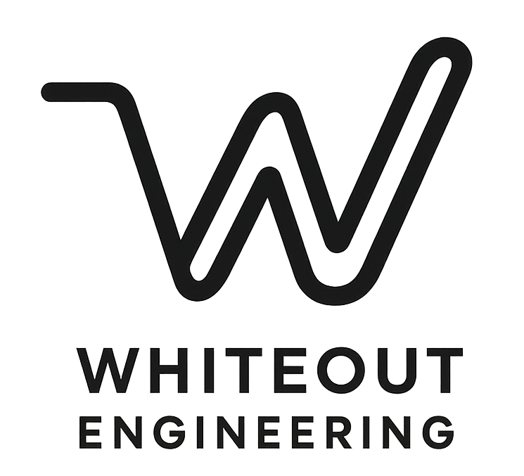

- Table of Content
{:toc}

## Whiteout Engineering

上場企業を支えてきた技術力と、個人事業主ならではのきめ細やかなサービスで、北海道の業務効率化や新たなサービス開発といった挑戦を強力に後押し。

  

    <ul>
      <li>事業内容: IT システム開発・運用およびコンサルティング、ランディングページ作成</li>
      <li>札幌商工会議所 会員</li>
      <li>適格請求書発行事業者</li>
      <li><a href="PHILOSOPHY.html">理念</a></li>
      <li><a href="https://forms.gle/nB8PQUMGmictsqG4A">お仕事のご相談</a></li>
    </ul>
  

    
  

## About me

   

クラウドインフラエンジニアとして 10 年以上の経験を持ち、特に AWS を活用した大規模 Web サービスの設計・構築・運用に強み。

一部上場企業における会員数 1,000 万人規模のシステム運用やクラウド移行、ベンチャー企業におけるドメイン移行・コンテナ化など、インフラ周りの業務に数多く従事。

### 職務経歴

[tsubasaogawa/resume](https://github.com/tsubasaogawa/resume)

### 得意分野

- **Web サービスのインフラ構築・運用**
- **コンテナ・IaC (Infrastructure as Code) を用いたアーキテクチャの設計・構築**
- **運用を見据えた技術選定**: 作って終わりではなく、未来に負債を残さない
- 写真撮影 (アマチュアカメラマン歴 10 年+)

### 不得意分野

- スマホアプリ開発
- フロントエンド開発 (AI を使えば簡単なものはできるかもしれませんが期待しないでください)
- SNS (ソーシャルネットワーク) 関係

### 興味

- **AI で運用しやすいクラウドインフラの構築**
	- 人口減少社会をふまえ、最小の人員でシステムのインフラを効率よく運用できる仕組みを模索
	- AI にも人間にもフレンドリーなコードは 5 年後、10 年後の資産となる
- **北海道への IT 支援**
	- 自身の強みで大好きな地を支えていく。そして技術を未来につなぐ

### More information

- 北海道大学 大学院情報科学研究科 修士課程修了 (情報工学)
	- 研究分野: 音声言語処理、自然言語処理
- GitHub: [@tsubasaogawa](https://github.com/tsubasaogawa)
- Qiita: [@tsubasaogawa](https://qiita.com/tsubasaogawa)
- 前職のテックブログ記事: [t_ogawa](https://techblog.openwork.co.jp/archive/author/t_ogawa)
- フリーソフト活動 (過去)
	- [Vector 作者ページ](https://www.vector.co.jp/vpack/browse/person/an026882.html)
		- 2002/11 新着ソフトレビュー ([送ろう](https://www.vector.co.jp/magazine/softnews/021116/n0211163.html))
- 受賞歴
	- [HSP プログラムコンテスト 2004 秀和システム賞](https://www.onionsoft.net/hsp/contest2004/place.html) (Hyper Speed Player)
	- [HSP プログラムコンテスト 2005 秀和システム賞](http://www.onionsoft.net/hsp/contest2005/place.html) (Drop'n FTP)
- [雑記]()
- [Email](/assets/qr_email.png)
